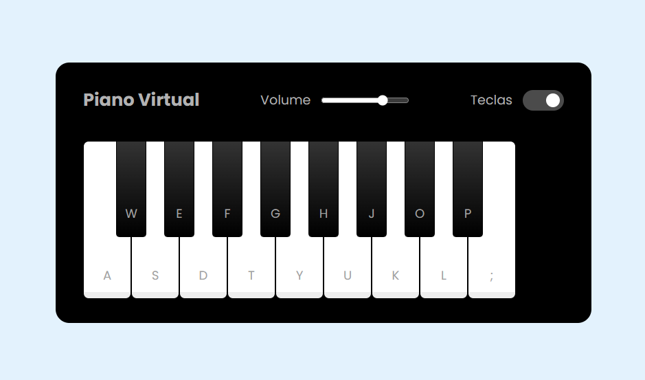

# Bootamp DIO - Potência Tech iFood - Desenvolvimento de Jogos

## Lab: Construindo um Simulador de Piano com JavaScript

## Detalhes 
- Tecnologias: HTML, CSS e JavaScript
- Link para jogar: [Simulador de Piano](https://fisiofaz.github.io/Simulador.Piano.JS.DIO/)
- Link do Projeto:[Page do Projeto](https://github.com/fisiofaz/Simulador.Piano.JS.DIO)
